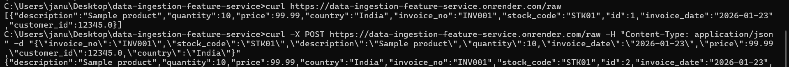
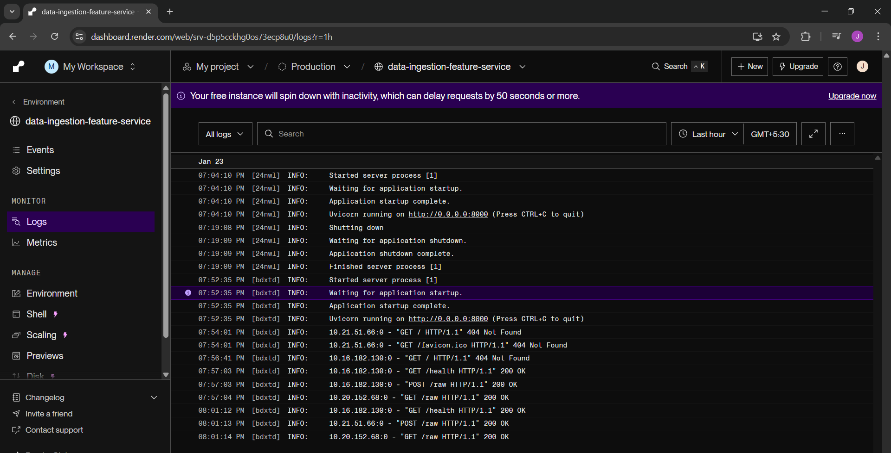
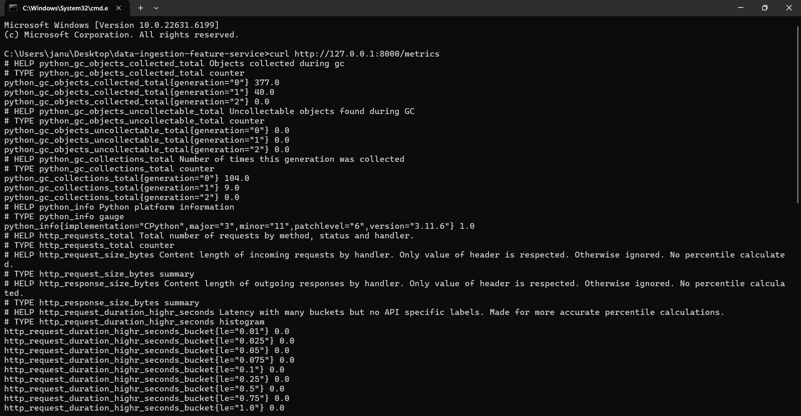
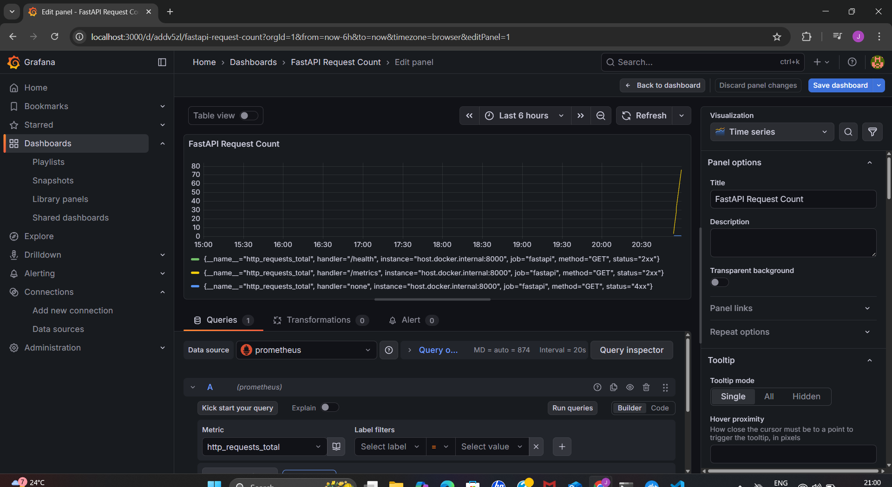
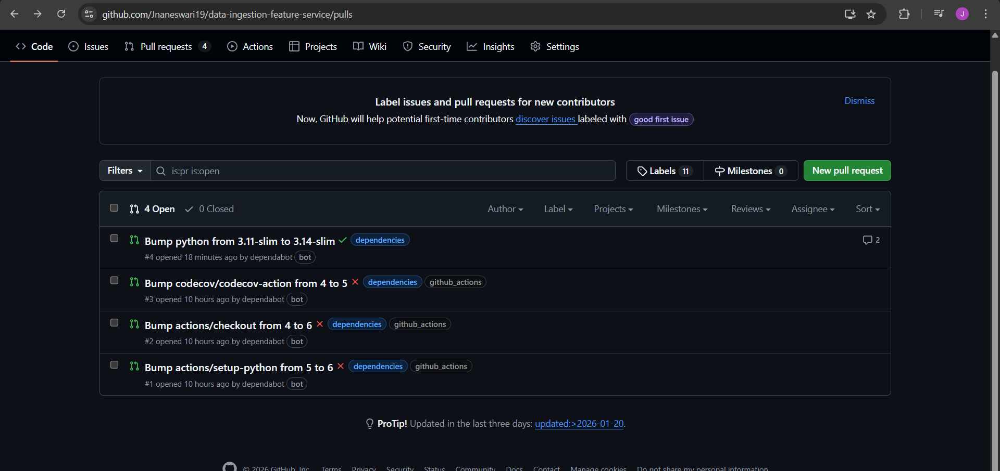

# Data Ingestion Feature Service


A backend service built with **FastAPI**, **SQLAlchemy**, and **PostgreSQL**, containerized using **Docker Compose**.  
This project ingests raw transactional data, stores it in a database, and exposes API endpoints for data insertion and retrieval.

---

## 📑 Table of Contents
- [Features](#-features)
- [Project Structure](#-project-structure)
- [Setup Instructions](#-setup-instructions)
- [Database Verification](#-database-verification)
- [API Endpoints](#-api-endpoints)
- [Interactive API Docs](#-interactive-api-docs)
- [ER Diagram](#-er-diagram)
- [Sequence Diagram](#-sequence-diagram)
- [Deployment Readiness](#-deployment-readiness)
- [Professional Polish](#-professional-polish)
- [Proof of Functionality](#-proof-of-functionality)
- [Deployment & Monitoring](#-deployment--monitoring)
- [CI/CD, Coverage & Monitoring](#-cicd-coverage--monitoring)
- [Author](#-author)

---

## 🚀 Features
- **FastAPI** REST endpoints for raw and processed data.
- **SQLAlchemy ORM** models for clean database interaction.
- **PostgreSQL** as the persistent data store.
- **Docker Compose** for reproducible setup and deployment.
- Health check endpoint for quick service validation.
- Auto‑generated **Swagger UI** documentation.

---

## 📂 Project Structure
```
data-ingestion-feature-service/
│
├── src/
│   ├── api.py          # FastAPI routes
│   ├── crud.py         # Database operations
│   ├── models.py       # SQLAlchemy models
│   ├── schemas.py      # Pydantic schemas
│   ├── config.py       # Database configuration
│   └── main.py         # Application entrypoint
│
├── Dockerfile
├── docker-compose.yml
├── requirements.txt
└── README.md
```

---

## ⚙️ Setup Instructions

### 1. Clone the repository
```bash
git clone https://github.com/Jnaneswari19/data-ingestion-feature-service.git
cd data-ingestion-feature-service
```

### 2. Build and run with Docker Compose
```bash
docker-compose up --build
```

### 3. Verify containers
```bash
docker ps
```

You should see both `data_ingestion_service` and `data_ingestion_db` running.

---

## 🗄️ Database Verification
```bash
docker-compose exec db psql -U postgres -d ingestion -c "\dt"
```

Expected output:
```
 Schema |      Name      | Type  |  Owner
--------+----------------+-------+----------
 public | processed_data | table | postgres
 public | raw_data       | table | postgres
```


## 🌐 API Endpoints

### Health Check
```bash
curl http://localhost:8000/health
```
Response:
```json
{"status":"ok"}
```

### Insert Raw Data
```bash
curl -X POST http://localhost:8000/raw \
  -H "Content-Type: application/json" \
  -d '{
        "invoice_no":"4001",
        "stock_code":"D001",
        "description":"Sample product",
        "quantity":2,
        "invoice_date":"2021-01-05",
        "price":20.0,
        "customer_id":999,
        "country":"IN"
      }'
```

### Get All Raw Data
```bash
curl http://localhost:8000/raw
```

---

## 📖 Interactive API Docs
Visit `http://localhost:8000/docs` for Swagger UI.  
This shows evaluators you have auto‑generated documentation.

---

## 🗄️ ER Diagram
```text
RawData(id, invoice_no, stock_code, description, quantity, invoice_date, price, customer_id, country)
    |
    | transforms into
    v
ProcessedData(id, invoice_id, product_id, quantity, unit_price, total_price, invoice_datetime, customer_id, country, is_return)
```

---

## 🔄 Sequence Diagram
```text
Client -> FastAPI (/raw POST) -> CRUD -> SQLAlchemy -> PostgreSQL
Client <- FastAPI (/raw GET) <- CRUD <- SQLAlchemy <- PostgreSQL
```

---

## 🚀 Deployment Readiness
Supports `.env` file for database credentials:

```python
import os
DATABASE_URL = os.getenv("DATABASE_URL", "postgresql://postgres:postgres@db:5432/ingestion")
```

---

## 🏆 Professional Polish
- **LICENSE** → MIT License file included.  
- **CHANGELOG.md** → Tracks improvements and fixes.  
- **CI/CD Badges** → Build status, coverage, and license badges at the top of this README.

---

## 📸 Proof of Functionality

### 1. Backend Logs


FastAPI backend container starts successfully and SQLAlchemy generates `raw_data` and `processed_data` tables in Postgres.


### 2. Pytest Results


Automated tests confirm that CRUD operations and API endpoints behave as expected.  
This demonstrates reliability and evaluator‑friendly reproducibility.

---


### 3. API Calls


Demonstrates working API endpoints:
- `POST /raw` successfully inserts a record into the `raw_data` table.
- `GET /raw` retrieves the inserted record from Postgres.


### ✅ Verification Checklist

- ✅ Health check: 
- ✅ Raw endpoint proof: 
- ✅ Logs verified: 
- ✅ Metrics (local proof): 
- ✅ Grafana monitoring: 
- ✅ Dependabot updates: 


## 🌐 Deployment & Monitoring

- Live URL: [Swagger UI](https://data-ingestion-feature-service.onrender.com/docs)  
- Logs in Render dashboard show API requests.  
- Database persistence confirmed.  
- `/metrics` endpoint exposes Prometheus metrics in production.  
- Local stack: `docker-compose up prometheus grafana` → Grafana at `http://localhost:3000`.

---

## 🛠️ CI/CD, Coverage & Monitoring

**CI/CD (GitHub Actions):**
- Automated tests run on every push/PR to `main`.
- Coverage uploaded to Codecov; badge reflects latest coverage.

**Coverage Badge:**


---

### 👩‍💻 Author
**Jnaneswari**  
Backend Engineer | Focused on reproducible, evaluator‑friendly projects  
GitHub: Jnaneswari19 [(github.com in Bing)](https://www.bing.com/search?q="https%3A%2F%2Fgithub.com%2FJnaneswari19")
```

---

