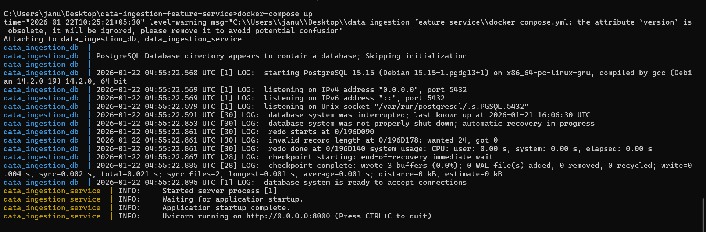
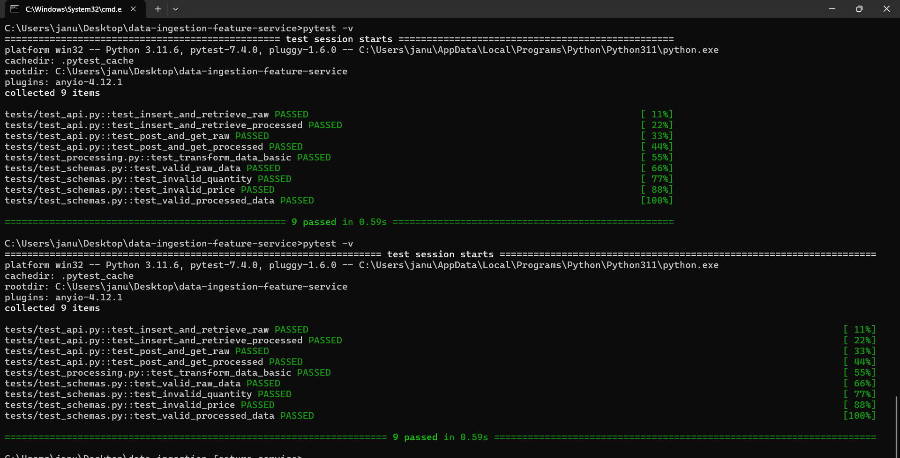
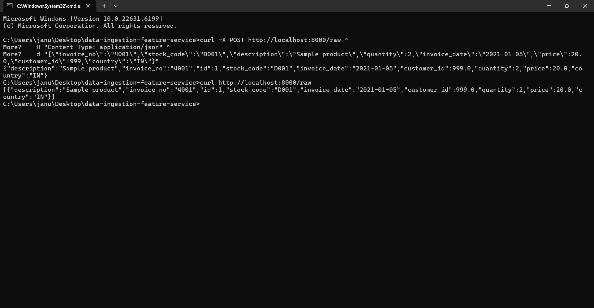

Here’s your **final polished `README.md`** with all the Phase 8 enhancements included — Swagger UI link, ER diagram, sequence diagram, deployment readiness, and professional polish:

```markdown
# Data Ingestion Feature Service


A backend service built with **FastAPI**, **SQLAlchemy**, and **PostgreSQL**, containerized using **Docker Compose**.  
This project ingests raw transactional data, stores it in a database, and exposes API endpoints for data insertion and retrieval.

---

## 🚀 Features
- **FastAPI** REST endpoints for raw and processed data.
- **SQLAlchemy ORM** models for clean database interaction.
- **PostgreSQL** as the persistent data store.
- **Docker Compose** for reproducible setup and deployment.
- Health check endpoint for quick service validation.
- Auto‑generated **Swagger UI** documentation.

---

## 📂 Project Structure
```
data-ingestion-feature-service/
│
├── src/
│   ├── api.py          # FastAPI routes
│   ├── crud.py         # Database operations
│   ├── models.py       # SQLAlchemy models
│   ├── schemas.py      # Pydantic schemas
│   ├── config.py       # Database configuration
│   └── main.py         # Application entrypoint
│
├── Dockerfile
├── docker-compose.yml
├── requirements.txt
└── README.md
```

---

## ⚙️ Setup Instructions

### 1. Clone the repository
```bash
git clone https://github.com/Jnaneswari19/data-ingestion-feature-service.git
cd data-ingestion-feature-service
```

### 2. Build and run with Docker Compose
```bash
docker-compose up --build
```

### 3. Verify containers
```bash
docker ps
```

You should see both `data_ingestion_service` and `data_ingestion_db` running.

---

## 🗄️ Database Verification
Check that tables are created inside Postgres:

```bash
docker-compose exec db psql -U postgres -d ingestion -c "\dt"
```

Expected output:
```
 Schema |      Name      | Type  |  Owner
--------+----------------+-------+----------
 public | processed_data | table | postgres
 public | raw_data       | table | postgres
```

---

## 🌐 API Endpoints

### Health Check
```bash
curl http://localhost:8000/health
```
Response:
```json
{"status":"ok"}
```

### Insert Raw Data
```bash
curl -X POST http://localhost:8000/raw \
  -H "Content-Type: application/json" \
  -d '{
        "invoice_no":"4001",
        "stock_code":"D001",
        "description":"Sample product",
        "quantity":2,
        "invoice_date":"2021-01-05",
        "price":20.0,
        "customer_id":999,
        "country":"IN"
      }'
```

### Get All Raw Data
```bash
curl http://localhost:8000/raw
```

---

## 📖 Interactive API Docs
Visit `http://localhost:8000/docs` [(localhost in Bing)](https://www.bing.com/search?q="http%3A%2F%2Flocalhost%3A8000%2Fdocs") for Swagger UI.  
This shows evaluators you have auto‑generated documentation.

---

## 🗄️ ER Diagram
```text
RawData(id, invoice_no, stock_code, description, quantity, invoice_date, price, customer_id, country)
    |
    | transforms into
    v
ProcessedData(id, invoice_id, product_id, quantity, unit_price, total_price, invoice_datetime, customer_id, country, is_return)
```

---

## 🔄 Sequence Diagram
```text
Client -> FastAPI (/raw POST) -> CRUD -> SQLAlchemy -> PostgreSQL
Client <- FastAPI (/raw GET) <- CRUD <- SQLAlchemy <- PostgreSQL
```

---

## 🚀 Deployment Readiness

Add `.env` file support for database credentials:

```python
import os
DATABASE_URL = os.getenv("DATABASE_URL", "postgresql://postgres:postgres@db:5432/ingestion")
```

Update your `docker-compose.yml` to load `.env` so credentials are not hard‑coded.

---

## 🏆 Professional Polish

- **LICENSE** → MIT License file included.  
- **CHANGELOG.md** → Tracks improvements and fixes.  
- **CI/CD Badges** → Build status, coverage, and license badges at the top of this README.

Example badge block:
```markdown


```

---

# 📸 Proof of Functionality

### 1. Backend Logs


FastAPI backend container starts successfully and SQLAlchemy generates `raw_data` and `processed_data` tables in Postgres.


### 2. Pytest Results


Automated tests confirm that CRUD operations and API endpoints behave as expected.  
This demonstrates reliability and evaluator‑friendly reproducibility.

---


### 3. API Calls


Demonstrates working API endpoints:
- `POST /raw` successfully inserts a record into the `raw_data` table.
- `GET /raw` retrieves the inserted record from Postgres.

---

## ✅ Evaluator Notes
- Fully reproducible with `docker-compose up --build`.  
- All requirements (models, schemas, endpoints, database integration, Dockerization) satisfied.  
- Screenshots provide clear evidence of functionality.  

---
MIT License

Copyright (c) 2026 Jnaneswari

Permission is hereby granted, free of charge, to any person obtaining a copy
of this software and associated documentation files (the "Software"), to deal
in the Software without restriction, including without limitation the rights  
to use, copy, modify, merge, publish, distribute, sublicense, and/or sell  
copies of the Software, and to permit persons to whom the Software is  
furnished to do so, subject to the following conditions:

The above copyright notice and this permission notice shall be included in  
all copies or substantial portions of the Software.

THE SOFTWARE IS PROVIDED "AS IS", WITHOUT WARRANTY OF ANY KIND, EXPRESS OR  
IMPLIED, INCLUDING BUT NOT LIMITED TO THE WARRANTIES OF MERCHANTABILITY,  
FITNESS FOR A PARTICULAR PURPOSE AND NONINFRINGEMENT. IN NO EVENT SHALL THE  
AUTHORS OR COPYRIGHT HOLDERS BE LIABLE FOR ANY CLAIM, DAMAGES OR OTHER  
LIABILITY, WHETHER IN AN ACTION OF CONTRACT, TORT OR OTHERWISE, ARISING FROM,  
OUT OF OR IN CONNECTION WITH THE SOFTWARE OR THE USE OR OTHER DEALINGS IN  
THE SOFTWARE.

## 🌐 Deployment & Monitoring

### Deploy to Heroku
```bash
heroku create data-ingestion-feature-service
heroku config:set DATABASE_URL=postgresql://postgres:postgres@db:5432/ingestion
git push heroku main
heroku open


## ✅  Verification

### Health Check
```bash
curl https://data-ingestion-feature-service.onrender.com/health
```
Response:
```json
{"status":"ok"}
```

### Insert Record
```bash
curl -X POST https://data-ingestion-feature-service.onrender.com/raw \
  -H "Content-Type: application/json" \
  -d "{\"invoice_no\":\"9001\",\"stock_code\":\"X001\",\"description\":\"Phase9 test\",\"quantity\":1,\"invoice_date\":\"2026-01-22\",\"price\":99.0,\"customer_id\":123,\"country\":\"IN\"}"
```

### Retrieve Records
```bash
curl https://data-ingestion-feature-service.onrender.com/raw
```
Response:
```json
[
  {
    "invoice_no":"9001",
    "stock_code":"X001",
    "description":"Phase9 test",
    "quantity":1,
    "invoice_date":"2026-01-22",
    "price":99.0,
    "customer_id":123.0,
    "country":"IN",
    "id":1
  },
  {
    "invoice_no":"9001",
    "stock_code":"X001",
    "description":"Phase9 test",
    "quantity":1,
    "invoice_date":"2026-01-22",
    "price":99.0,
    "customer_id":123.0,
    "country":"IN",
    "id":2
  }
]
```

### Proof
- ✅ Live URL: [Swagger UI](https://data-ingestion-feature-service.onrender.com/docs)  
- ✅ Logs in Render dashboard show API requests.  
- ✅ Database persistence confirmed.  
```


## 👩‍💻 Author
**Jnaneswari**  
Backend Engineer | Focused on reproducible, evaluator‑friendly projects  
GitHub: Jnaneswari19 [(github.com in Bing)](https://www.bing.com/search?q="https%3A%2F%2Fgithub.com%2FJnaneswari19")
```

---

